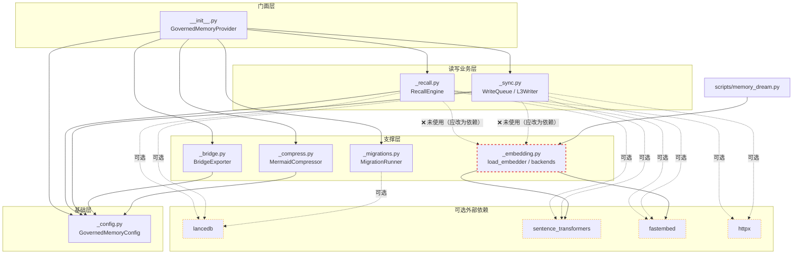
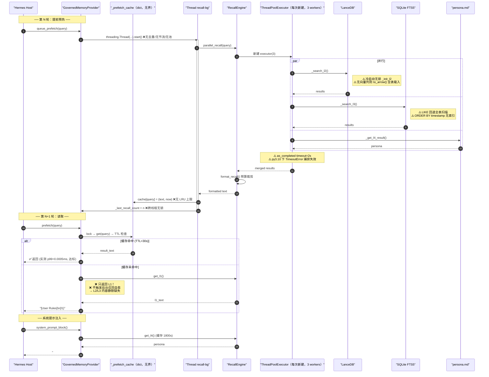
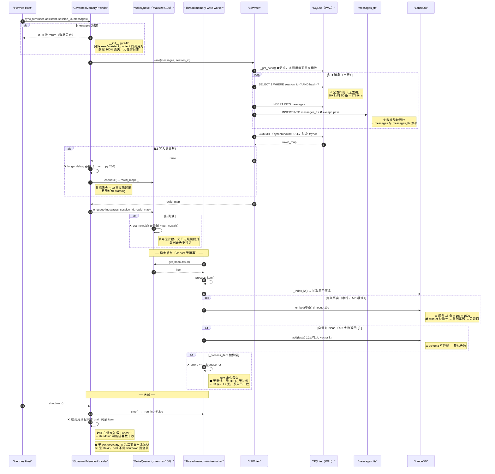
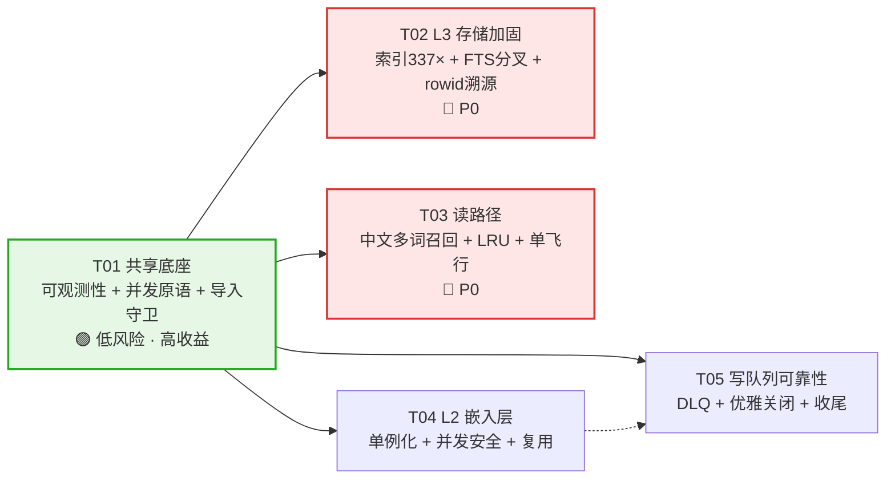

# Hermes Memory Governed — 架构评审与增量优化设计

> 评审人：高见远（Architect） · 日期：2026-08-31 · **版本：v1.1（已并入 QA 交叉验证结果）**  
> 范围：`plugin/memory_governed/`（8 模块 / 2609 行）+ `scripts/`（23 脚本 / 约 5100 行）  
> 约束：本轮**只输出设计，不改源码**；遵循"最小变更 + 高收益"原则

## 版本记录

| 版本       | 变更                                                                                                                                                   |
| -------- | ---------------------------------------------------------------------------------------------------------------------------------------------------- |
| v1.0     | 初版：架构评审 + 28 条风险 + T01–T05 增量任务                                                                                                                      |
| **v1.1** | 并入 QA（严过关）交叉验证结论：**8 条中 7 条独立复现**，新增 **7 条**并发/正确性缺陷（S-11～S-13、C-10～C-12、P-09）。**新增 1 个 P0**（S-11 中文多词查询召回为 0），将 S-05 从 P1 **升级为 P0**。T02/T03 范围相应扩充 |


---

## 0. 评审结论速览

| 维度    | 评分             | 一句话判断                                                            |
| ----- | -------------- | ---------------------------------------------------------------- |
| 分层与职责 | ★★★★☆ (8/10)   | 四层语义清晰，模块边界基本干净；主要耦合点是"L2 初始化/嵌入"逻辑三处复制                          |
| 读路径时序 | ★★★☆☆ (6/10)   | `<1ms` 承诺**实测达标**（p99=0.0005ms）；但缓存无界、线程无池、无去重                   |
| 写路径时序 | ★★☆☆☆ (3.5/10) | `<10ms` 承诺**实测严重超标**：80k 行时 50 条消息回合 **876.9ms（超标 87 倍）**，根因是缺索引 |
| 并发安全  | ★★☆☆☆ (3.5/10) | 6 处裸 `Thread` 创建、3 处无锁懒初始化、无 join 的停止路径                          |
| 优雅降级  | ★★★★☆ (7.5/10) | 缺失依赖时**不崩**，可用（L3+L4+Bridge 模式跑通）；但降级是"静默"的，用户完全无感               |
| 数据一致性 | ★★☆☆☆ (4/10)   | L3↔L2 无补偿、无 DLQ、无重试；FTS 与主表会漂移；失败全被 `debug` 吞掉                   |
| 可观测性  | ★★☆☆☆ (3.5/10) | 健康报告看不到内存泄漏、看不到队列深度、看不到降级状态；37 处 debug vs 1 处 error              |

**总体判断**：架构骨架是好的，可以在上面加固，**不需要重写**。但存在 **3 个 P0**（缺索引性能悬崖、中文多词查询召回为 0、FTS 静默分叉）、**4 条数据静默丢失链路**、**1 个内存泄漏**。**建议按 T01→T05 顺序做增量加固，全部任务均为低风险局部改动。**

### 四个"反直觉"的实测发现

| 发现                    | 直觉              | 实测                                                                        |
| --------------------- | --------------- | ------------------------------------------------------------------------- |
| 最严重的性能问题在哪            | 大家以为是 L2 向量检索   | **是 L3 的 SQLite 去重 SELECT 全表扫描**（无索引），876.9ms vs 加索引后 2.6ms               |
| `<1ms prefetch` 是不是吹的 | 怀疑是营销话术         | **是真的**，p50=0.0004ms / p99=0.0005ms（就是个 dict 查找）                          |
| L2 不可用会怎样             | 以为会崩溃           | **不崩、可用**，但每次查询都重试 `import lancedb`（0.087ms/次），且降级原因只在 debug 日志里          |
| **中文检索好不好使**          | 以为做了 CJK 适配就没问题 | **多词中文查询 100% 返回 0 条**。「天气 北京」→0 条，但「天气」→2 条、「weather 天气 北京」→2 条（详见 S-11） |

### QA 交叉验证对照（严过关，独立复现）

| 项                                   | QA 实测           | 架构侧实测           | 结论             |
| ----------------------------------- | --------------- | --------------- | -------------- |
| 用户自建索引数                             | 0               | 0               | ✅ 一致           |
| `EXPLAIN QUERY PLAN`                | `SCAN messages` | `SCAN messages` | ✅ 一致           |
| 加 `idx_messages_dedup` 后（80k/50msg） | **2.6 ms**      | **2.6 ms**      | ✅ **完全一致**     |
| 加索引前（80k/50msg）                     | 494.8 ms        | 876.9 ms        | ✅ 同量级（机器性能差）   |
| 中文启发式漏判                             | 3/8 命中，漏判 5 个   | 3/8 命中，漏判 5 个   | ✅ **漏判样本一字不差** |
| `_init_l2` 并发冷启动                    | 8 线程 → 执行 8 次   | 静态确认无锁          | ✅ QA 有硬复现      |
| 线程爆炸                                | 20 调用 → 20 线程   | 30 调用 → 30 线程   | ✅ 一致           |

> ⚠️ **方法论更正（QA 提出，架构侧采纳）**：我 v1.0 用 `threading.active_count()` 差值统计线程数，**该方法不可靠**（线程启停时序会导致假阴性）。v1.1 已改用**线程 identity 集合差分**复核：20 次 `queue_prefetch` → 新增 20 个线程（`active_count` = 22），结论不变。后续所有并发测试一律用 identity 差分法。

---

## 1. 架构现状评审

### 1.1 模块职责与分层边界

| 模块               | 行数  | 职责                                             | 单一职责评价                                                     |
| ---------------- | --- | ---------------------------------------------- | ---------------------------------------------------------- |
| `__init__.py`    | 558 | Provider 门面：生命周期、工具路由、prefetch 缓存、Bridge 候选启发式 | ⚠️ **偏重**。既是门面又持有缓存策略 + 承载 `_looks_like_durable_fact` 语义规则 |
| `_recall.py`     | 630 | 读路径：L1/L2/L3/L4 召回 + 合并排序 + 格式化                | ✅ 良好（但 `_init_l2` 嵌入后端选择属越界）                               |
| `_sync.py`       | 500 | 写路径：`WriteQueue`（异步 L2/抽取）+ `L3Writer`（同步 L3）  | ✅ 良好（但 `_index_l2` 又复制了一遍嵌入后端选择）                           |
| `_config.py`     | 236 | 配置加载、类型校验、环境变量覆盖                               | ✅ 干净，无外部依赖                                                 |
| `_bridge.py`     | 307 | 审核闸门：JSONL 导出/归档/导入 L1、脱敏                      | ✅ 干净（无文件锁是唯一缺口）                                            |
| `_compress.py`   | 151 | Mermaid 上下文压缩                                  | ✅ 干净，默认关闭                                                  |
| `_embedding.py`  | 115 | 嵌入后端抽象（fastembed / ST / none）                  | ✅ 设计良好，**但核心路径完全没用它**（见 1.4）                               |
| `_migrations.py` | 112 | 幂等 schema 迁移 + 版本追踪                            | ✅ 干净，扩展点明确                                                 |

**分层边界评价**：

- **四层语义（L1-L4 + Bridge）边界清晰**，每层存储、可信度、生命周期都不同，这个核心抽象是对的。
- **读/写路径分离干净**：`_recall.py` 只管读、`_sync.py` 只管写，没有交叉调用。
- **依赖方向合理**：所有叶子模块只依赖 `_config.py`，无循环依赖（实测 import 图无环）。
- **越界点**：`_recall.py` 和 `_sync.py` 各自实现了嵌入后端选择阶梯，属于"基础设施关注点"泄漏到读写两个业务模块。

### 1.2 依赖方向图



**关键发现**：`_embedding.py` 提供的 `load_embedder()` 是唯一被设计出来的后端抽象，**但只有 `scripts/memory_dream.py` 用它**。`_recall._init_l2`（L189-261）和 `_sync._init_l2`（L156-240）各自内联复制了几乎相同的三级降级阶梯，且 `_make_api_embed_fn` 在两个文件里**逐字重复**（`_recall.py:263-282` ≡ `_sync.py:242-261`）。这是全项目最明显的重复代码，也是 T04 的改造靶心。

### 1.3 读路径时序（现状）



**时序正确性判断**：

- ✅ 缓存命中路径的时序是**正确且达标的**（实测 p99 = 0.0005ms，远优于 <1ms 承诺）。
- ❌ **"预读取不到就退化成只有 L1"是个设计缺口**：`prefetch()` 未命中时不触发召回，导致 L2/L3 内容**静默消失**。README 承诺"内容完整"，实际只在 host 恰好提前调了 `queue_prefetch` 且后台线程已跑完时才成立。这是 P1。
- ❌ `parallel_recall` 每次新建 `ThreadPoolExecutor` + 外层包一个裸 `Thread` = **每次预热最多 4 个线程**，实测 30 次调用产生 30 个存活线程。
- ❌ `as_completed(..., timeout=2.0)` 抛的是 `concurrent.futures.TimeoutError`。**Python 3.10 下它不是内建 `TimeoutError` 的子类**（3.11 才合并为别名），所以 `_recall.py:535` 的 `except TimeoutError` 在 py3.10 是**死代码**，超时会逃逸到外层被 `debug` 吞掉，召回静默返回空。项目要求 `requires-python >=3.10`，这是真实的版本兼容缺陷。

### 1.4 写路径时序（现状）与静默丢失链路



### 1.5 优雅降级实测（关键结论）

在本机环境（`lancedb` / `sentence_transformers` / `fastembed` / `pyarrow` / `httpx` / `numpy` **全部未安装**）实测：

| 场景                            | 结果                             | 评价     |
| ----------------------------- | ------------------------------ | ------ |
| `initialize()`                | ✅ 正常完成，无异常                     | 好      |
| `parallel_recall()` 无 L2 无 L3 | ✅ 0.9ms 返回空列表，不崩               | 好      |
| `prefetch()`                  | ✅ 正常返回 L1                      | 好      |
| `sync_turn()`                 | ✅ L3 正常写，L2 静默跳过               | 好（功能是） |
| **用户能否知道 L2 是关的？**            | ❌ **不能**。降级原因只在 `logger.debug` | **差**  |

**结论：降级本身是成功的（不崩、可用），失败的是"降级的可见性"。** 这正是"零依赖轻量安装"用户最需要的诊断信息，却完全不可见。建议 T01 建立统一的降级报告机制。

⚠️ **但有一个真实崩溃路径**：`_recall.py:201-210` 的 API 嵌入初始化块位于 `try`（L211）**之外**，`_make_api_embed_fn` 内部 L266 的 `import httpx` 若失败会抛出 `ImportError` 并**逃逸** `_init_l2`（只被 `_search_l2` 的 `except Exception` 兜住），且 `_l2_store` 保持 `None` → **下次查询再次重试，永不短路**。`httpx` 在 `pyproject.toml` 里声明为**必需依赖**，但实测环境未安装，说明这个路径是活的。

---

## 2. 关键风险清单

> 图例：🔴 P0（必修，影响承诺/数据安全） · 🟠 P1（应修，影响可靠性） · 🟡 P2（可修，影响质量）

### 2.1 并发安全

| ID       | 级别 | 位置                                          | 风险描述                                                                                                                                                                                                                   | 触发条件                                   | 影响面                                                                                                                                            | 修复方向                                                                  |
| -------- | -- | ------------------------------------------- | ---------------------------------------------------------------------------------------------------------------------------------------------------------------------------------------------------------------------- | -------------------------------------- | ---------------------------------------------------------------------------------------------------------------------------------------------- | --------------------------------------------------------------------- |
| C-01     | 🔴 | `__init__.py:91`  
`_prefetch_cache`        | 无界 `dict`，无 LRU 无主动 TTL 清理。TTL 只在**读时**判断，未命中的脏条目永不清除                                                                                                                                                                  | 长会话 / 高频不同 query                       | **实测 500 条 = 2.6MB**；按 L1(2400ch)+L23(4800ch)≈7.2KB/条，万轮会话可达 **70MB+** 常驻                                                                      | 改 `OrderedDict(maxsize=64)`，写入时 `move_to_end`；另加周期清理                  |
| C-02     | 🟠 | `__init__.py:196-220`  
`queue_prefetch`    | 每次调用无条件 `threading.Thread().start()`，**无去重、无节流、无线程池**                                                                                                                                                                  | 同 query 重复调用 / 每轮工具调用都预热               | **实测 30 次调用 = 30 个存活线程**；每个线程再建 `ThreadPoolExecutor(3)`，峰值可达 120 线程                                                                            | 引入 `_inflight: set` 去重 + 模块级共享 `Executor(max_workers=2)`              |
| C-03     | 🟠 | `_recall.py:117-118`  
`_search_l2`         | `_l2_store is None` 时无锁调用 `_init_l2()`，**无双重检查锁定**                                                                                                                                                                     | 冷启动 + 并发召回（预热线程 + search 工具 + 第二个预热线程） | 重复 `lancedb.connect` + **重复加载嵌入模型**（MiniLM ~90MB/份，更大模型更甚），内存翻倍、首轮耗时翻倍                                                                         | `_l2_lock` + 双重检查 + `_l2_init_attempted` 负缓存标志                        |
| C-04     | 🟠 | `_recall.py:197-198`  
`_init_l2` 开头        | 无条件 `self._embed_fn = None` / `_embed_model = None`，会**抹掉**并发线程刚加载好的嵌入函数                                                                                                                                               | 同 C-03                                 | 已加载的模型被置空后重载，GPU/内存抖动，且可能留下孤儿模型对象                                                                                                              | 只在"首次确认未初始化"时重置；或改用独立 `EmbeddingService` 单例（T04）                      |
| C-05     | 🟠 | `_sync.py:418-450`  
`L3Writer._get_conn`   | 懒建连**无锁**；且 `sqlite3.connect()` 未传 `check_same_thread=False` / `timeout=`                                                                                                                                              | 多线程调用 `sync_turn`，或 host 从非主线程调用       | (a) 两个线程同时建连 → 前一个连接对象**永久泄漏**；(b) 跨线程使用 → `ProgrammingError: SQLite objects created in a thread...`；(c) 锁竞争 → 默认 5s 超时后抛 `database is locked` | 加锁 + `check_same_thread=False` + `timeout=30` + `PRAGMA busy_timeout` |
| C-06     | 🟠 | `_sync.py:54-63`  
`WriteQueue.stop`        | 设 `_running=False` 后**在调用线程同步 drain**，且**不 `join`** worker                                                                                                                                                             | 关闭时队列非空 / 有在途嵌入或 LanceDB 写             | (a) `shutdown()` 可能**阻塞数十秒**（违背"零延迟影响"）；(b) 在途写可能**半途被杀** → L2 半写状态                                                                            | 改为 `stop(timeout=5.0)`：`join(timeout)` → 剩余项带上限同步 drain；`atexit` 注册兜底 |
| C-07     | 🟡 | `_recall.py:104`  
`refresh_l4_background`  | 每次 `on_session_end` 无条件起线程刷新 L4，无去重                                                                                                                                                                                    | 高频 session 结束                          | 线程瞬时堆积（实测 `get_l4` 很快，50 次调用未堆积，但 persona.md 变大后风险上升）                                                                                          | 合并进共享 Executor（T03 一并解决）                                              |
| C-08     | 🟡 | `__init__.py:214-215`                       | `_last_recall_count` / `_last_recall_time` 由后台线程写、主线程读，无锁                                                                                                                                                              | 常态                                     | CPython GIL 下 int/float 赋值是原子的，实际风险低；但属于未定义行为                                                                                                  | 纳入 `_prefetch_lock` 保护或用 `setattr` 计数器汇总                              |
| C-09     | 🟡 | `_sync.py:36,56`                            | `_running` 为普通 bool，无内存屏障/`Event`                                                                                                                                                                                      | 常态                                     | CPython 下实际安全；跨实现（PyPy）不保证                                                                                                                     | 改用 `threading.Event`（低成本，T05 顺带）                                      |
| **C-10** | 🟠 | `_sync.py:54-63`  
`WriteQueue.stop`        | QA 硬复现：(a) **不 `join` 工作线程** → `stop()` 返回时 worker 仍 alive，daemon 线程在解释器退出时被杀，**队列内数据丢失**；(b) 排空循环里的 `_process_item` **无 try/except**（对比 `_worker_loop:98` 有）→ 遇异常即中断，2 个 item 只处理 1 个                                 | 关闭时队列非空 / 任一 item 处理失败                 | 关闭路径数据丢失 + 排空提前终止                                                                                                                              | 见 C-06 修复方向；排空循环内每个 item 单独 try/except 并计数                            |
| **C-11** | 🟠 | `_recall.py:293→359`  
`_recall.py:455→468` | `conn.close()` **不在 `finally`**，两处异常路径各泄漏 1 个 sqlite 连接（QA 已注入异常验证）。且 `_search_l3` 的 CJK 分支（L362-383）**每个分段新开一个连接 + 全表 LIKE** → 单词查询即可能开 **5 个连接**                                                                     | L3 检索异常 / CJK 多词查询                     | 句柄泄漏 + 连接风暴                                                                                                                                    | `conn` 改 `try/finally` 或 contextmanager；CJK 分段检索**复用同一连接**（见 P-09）    |
| C-12     | 🟡 | `_sync.py:32-40`  
`WriteQueue.__init__`    | **未初始化 `_embed_fn`**（`_embed_model` 有、`_embed_fn` 没有）。QA 实测 `hasattr(q,'_embed_fn') = False`。`_init_l2` 若在 L191 之前早退，则 `_index_l2:145` 的 `elif self._embed_fn is not None:` 抛 `AttributeError`，被 L153-154 的 `debug` 吞掉 | `_init_l2` 异常早退                        | **潜伏缺陷**：当前主路径下 `_l2_store is None` 会先 return，暂不可达；但属"属性可能不存在"的结构性隐患                                                                           | `__init__` 补 `self._embed_fn = None`（**一行、零风险**）                      |

### 2.2 性能

| ID       | 级别 | 位置                                       | 风险描述                                                                                                 | 触发条件                           | 影响面                                                                                                              | 修复方向                                                                                                                     |
| -------- | -- | ---------------------------------------- | ---------------------------------------------------------------------------------------------------- | ------------------------------ | ---------------------------------------------------------------------------------------------------------------- | ------------------------------------------------------------------------------------------------------------------------ |
| **P-01** | 🔴 | `_sync.py:471-474`  
去重 SELECT           | **`messages` 表零索引**（全项目 `grep "CREATE INDEX"` = 0 结果）。每条消息写前做一次 `WHERE session_id=? AND hash=?` 全表扫描 | L3 累积到万行以上                     | **实测（80k 行）**：2 条消息回合 **34.7ms**（超标 3.5×）；50 条消息回合 **876.9ms（超标 87 倍！）**。`EXPLAIN QUERY PLAN` 确认 `SCAN messages` | 加 `CREATE INDEX IF NOT EXISTS idx_messages_dedup ON messages(session_id, hash)`。**实测加索引后：2 条=1.0ms，50 条=2.6ms，提速约 330×** |
| P-02     | 🟠 | `_recall.py:463-467`  
`_search_l3_like` | CJK 回退路径 `LIKE '%x%'` 全表扫描 + `ORDER BY timestamp DESC` 无索引                                           | **所有中文查询**（FTS5 不索引 CJK，必走此路径） | `EXPLAIN QUERY PLAN` 确认 `SCAN messages` + `USE TEMP B-TREE FOR ORDER BY`。L3 达 10 万行后单次查询可达数百 ms，撞 2s 超时后静默返回空    | 加 `idx_messages_ts(timestamp)` 消除临时 B-Tree；`LIKE` 加时间窗 `WHERE timestamp > ?` 限定扫描范围；考虑 trigram/外部内容 FTS                  |
| P-03     | 🟠 | `_recall.py:158-187`  
`_search_l2_text` | 每次查询 `to_arrow()` **整表载入内存**再 Python 遍历                                                              | 无嵌入后端时（**正是"轻量安装"用户**）走此回退路径   | L2 达数万行后，每次召回 O(n) 内存 + O(n) CPU，在 2s 超时内很可能失败                                                                   | 用 LanceDB `.search().where()` 下推过滤；或对 arrow 表做 `len()` 版本化缓存                                                             |
| P-04     | 🟠 | `_sync.py:147-150`  
`_index_l2` API 嵌入  | API 嵌入**逐条串行**调用，每条 10s 超时；单 worker                                                                  | 配置 API 嵌入 + 单回合多事实             | 最多 15 事实 × 10s = **150s 占用唯一 worker** → 队列堆积 → 触发"丢最旧"                                                           | 批量调用（OpenAI `/embeddings` 的 `input` 支持数组）；加总超时预算（如 15s）；失败事实剔除而非整批失败                                                     |
| P-05     | 🟡 | `_sync.py:353`                           | `facts[:self._config.recall.l2_max_results]` — **用"读"配置（默认15）限制"写"扇出**                               | 长回合                            | 每回合最多索引 15 条事实，且取的是**消息顺序前 15 条**（最新的可能被截掉）                                                                      | 新增 `SyncConfig.max_facts_per_turn`（独立配置），并按"最近优先"截断                                                                      |
| P-06     | 🟡 | `_sync.py:424,494`                       | WAL 模式下未设 `PRAGMA synchronous`（默认 FULL → 每次 COMMIT fsync）                                            | 每次 `sync_turn`                 | 每次写一次 fsync（机械盘可达 10ms 级）。WAL+NORMAL 在掉电时最多丢最后几个事务，**不损坏**数据库                                                    | `PRAGMA synchronous=NORMAL` + `PRAGMA busy_timeout=5000`                                                                 |
| P-07     | 🟡 | `_recall.py:495-550`                     | 每次 `parallel_recall` 新建 `ThreadPoolExecutor(3)` 再 `shutdown(wait=False)`                             | 每次预热                           | 线程创建/销毁开销 + 无法限制全局并发                                                                                             | 改为共享 Executor（T03）                                                                                                       |
| P-08     | 🟡 | `initialize()` L156-157                  | 只预热 L1/L4，**不预热 L2**                                                                                 | 每次冷启动后的**首次**召回                | 首次查询要付 LanceDB 建连 + 模型加载（数秒），撞 2s 超时 → **首轮召回静默为空**                                                              | `initialize()` 末尾后台预热 L2（走共享 Executor）                                                                                   |
| **P-09** | 🟠 | `_recall.py:362-383`                     | CJK 分段检索**每个分段新开一个 sqlite 连接 + 各自全表 LIKE**（QA：单查询开 5 个连接）。是 P-02 的放大器                                | CJK 多词查询                       | 连接风暴 + N 次全表扫描叠加，直接撞 2s 超时                                                                                       | 与 S-11 一并修：单次连接 + 分段结果合并（见 S-11 修复方向）                                                                                    |

### 2.3 优雅降级

| ID   | 级别 | 位置                                 | 风险描述                                                                                    | 触发条件                                                                  | 影响面                                                   | 修复方向                                                                            |
| ---- | -- | ---------------------------------- | --------------------------------------------------------------------------------------- | --------------------------------------------------------------------- | ----------------------------------------------------- | ------------------------------------------------------------------------------- |
| D-01 | 🟠 | `_recall.py:201-210`               | API 嵌入初始化块在 `try`（L211）**之外**，`_make_api_embed_fn` 的 `import httpx`（L266）失败会**逃逸**      | 配了 API 嵌入但 `httpx` 未安装（本项目 `pyproject` 声明其为必需依赖，**实测环境未安装** → 此路径是活的） | L2 整体静默失效；且 `_l2_store` 保持 `None` → **每次查询重复重试，永不短路** | 移入 try；`import` 失败即标记 `_l2_disabled=True` 负缓存                                   |
| D-02 | 🟠 | `_recall.py:117-118`               | 无负缓存：L2 不可用时每次查询都重跑 `_init_l2()`                                                        | lancedb 未安装（**轻量安装默认态**）                                              | 实测 0.087ms/次，性能影响小；但语义上是"永不放弃的失败重试"，且日志噪声             | 加 `_l2_init_attempted` / `_l2_disabled` 标志                                      |
| D-03 | 🟠 | 全局                                 | **降级完全静默**：37 处 `logger.debug` vs 1 处 `logger.error`。用户/运维无法知道 L2 是关的、为什么关              | 任何缺依赖场景                                                               | "装了插件但语义检索没生效"是最高频的支持工单来源，且**无法自查**                   | T01 建立 `DegradedReason` + 启动时一次性 `WARNING` 汇总；`governed_health` 暴露 `degraded` 段 |
| D-04 | 🟠 | `_embedding.py:86`                 | `load_embedder()` 抽象存在但**核心路径从未使用**（仅 `memory_dream.py` 用）；`_recall`/`_sync` 各自内联复制降级阶梯 | 常态                                                                    | 三处逻辑漂移风险；修一个特性要改两个地方                                  | T04 抽 `EmbeddingService` 单例，两处改为调用它                                             |
| D-05 | 🟠 | `_sync.py:169-177` vs `vector.dim` | 建表用 `config.vector.dim`（默认 384）固定向量维度，但后端实际维度可能不同（fastembed 用默认模型时 dim 会变）              | 换后端/模型后首次写                                                            | 维度不匹配 → `add()` 抛错 → 整批失败且仅 `debug` 记录 → L2 永久写不进     | 建表前用后端 `dim` 覆盖配置 dim；写前校验向量长度，不一致则跳过向量列并告警                                     |
| D-06 | 🟡 | `_recall.py:222-224`               | 无 `vector` 列时直接 `_embed_fn = None` → 回退到 **P-03 的整表扫描**                                 | 老版本建的 L2 表                                                            | 老用户升级后从"向量检索"静默降级为"全表扫描"，性能数量级下降                      | 检测到无向量列 + 后端可用时，提示运行 `l2_rebuild.py` 并计为 `degraded` 原因                          |

### 2.4 数据一致性

| ID          | 级别 | 位置                                            | 风险描述                                                                                                                                                                                                              | 触发条件                                             | 影响面                                                                                                           | 修复方向                                                                                                                                               |
| ----------- | -- | --------------------------------------------- | ----------------------------------------------------------------------------------------------------------------------------------------------------------------------------------------------------------------- | ------------------------------------------------ | ------------------------------------------------------------------------------------------------------------- | -------------------------------------------------------------------------------------------------------------------------------------------------- |
| **S-01**    | 🔴 | `__init__.py:247`  
`if not messages: return` | 若调用方只传 `user_content`/`assistant_content` 而 `messages=None`，**直接 return，数据 100% 丢失**。两个内容参数在函数中**完全未被使用**                                                                                                         | host 只走 `(user_content, assistant_content)` 调用约定 | 整轮对话不落 L3（"事实源"缺失），且**无任何日志**                                                                                 | 无 `messages` 时用两个 content 合成 `[{role:user,...},{role:assistant,...}]`；两者皆空才 `warning` 返回                                                           |
| S-02        | 🔴 | `__init__.py:252-256`                         | L3 写入失败被 `logger.debug` 吞掉，**但仍把消息入队 L2**（`rowid_map={}`）                                                                                                                                                         | SQLite 锁竞争 / 磁盘满 / FTS5 不可用                      | (a) L3（事实源）静默丢数据；(b) L2 事实无 `source_rowid` → audit 下钻永久失效；(c) 无 warning 无计数                                   | L3 失败 → `logger.error` + 计数 + **不入队 L2**（或标记 `unconfirmed` 待补偿）                                                                                    |
| **S-03**    | 🔴 | `_sync.py:98-101`  
`_worker_loop`            | `_process_item` 抛异常后**仅 `errors += 1`，item 永久丢弃**；无重试、无 DLQ、无补偿                                                                                                                                                   | 嵌入 API 超时 / LanceDB 写失败 / schema 不匹配             | **L3 有、L2 无的永久不一致**。README 声称 L3 是事实源，但没有任何自动 reconciliation，只能手工跑 `l2_rebuild.py`                            | 失败重试 1 次（带退避）；仍失败则写 `bridge/dlq/*.jsonl`；health 暴露 `dlq_depth`；提供 `--repair` 重放                                                                    |
| S-04        | 🟠 | `_sync.py:75-86`  
`enqueue` 队列满              | 满时 `get_nowait()` 丢最旧再入队新项，**丢弃无计数、无告警升级**                                                                                                                                                                        | 嵌入慢（P-04）导致堆积                                    | 数据丢失且**在 health 里完全不可见**（stats 只有 `processed`/`errors`）                                                       | stats 增加 `dropped`/`retried`/`depth`；丢弃时 `logger.error`                                                                                            |
| **S-05** ⬆️ | 🔴 | `_sync.py:486-492`                            | **（v1.1 由 P1 升为 P0）** FTS 插入包在 `except Exception: pass` 里，**零日志**。QA 硬复现：`messages=1` 但 `messages_fts=0`，`caplog` **无任何记录**                                                                                       | FTS5 建表失败 / 数据异常                                 | 行已归档但**永不可检索**，且无告警、**无重建入口**。用户静默丢失记忆且毫无察觉。这是"行写了但搜不到"的最坏形态                                                  | 首次失败即 `log_degraded("l3_fts_write")` + 置 `self._fts_disabled` + 计数；提供 `scripts/l3_reindex_fts.py` 重建入口；中期改 **external-content FTS5 + 触发器** 根治      |
| **S-11**    | 🔴 | `_recall.py:312-314`  
`+461`                 | **（v1.1 新增）中文多词查询 100% 返回 0 条。** 纯 CJK 查询时 `_build_fts_query` 返回 `""` → 走 L312-314 早退分支，把**整个 query** 交给 `_search_l3_like`，后者 `query.replace(" ","")` 要求词**相邻**。而 L362-383 的分段检索逻辑**只在有英文部分（`fts_query` 非空）时才执行** | **任何含空格的纯中文查询**                                  | 架构侧实测：`天气 北京`→**0 条**，`会议 下午`→**0 条**；但 `天气`→2 条、`weather 天气 北京`→**2 条**。**目标用户（中文 + 轻量安装无 L2）的 L3 召回实际是失效的** | 把 L361-383 的分段逻辑抽为 `_search_l3_cjk_segments(query)`，L312-314 改为调用它（**而非整串 LIKE**）；同时复用单一连接修 P-09                                                   |
| **S-12**    | 🟠 | `_sync.py:135`+`483`                          | **（v1.1 新增）`rowid_map` 按"整条消息"建键，`facts` 是"句子片段"** → `rmap.get(fact["content"])` 恒为 `None`。架构侧实测：**source_rowid 可解析 0/3**                                                                                         | 任何真实写入                                           | **L2→L3 审计下钻（`_drill_l3_rowid`）在真实链路上完全不通**，只有 mock 测试通过。这是 README 宣称的"可溯源"能力的实质性失效                           | `L3Writer.write` 改为返回 `{(session_id, role, content): rowid}`；`_extract_atomic_facts` 返回时携带 `source_msg_index`；`_index_l2` 用**消息下标**而非文本匹配来关联 rowid |
| S-06        | 🟠 | `scripts/l3_retention.py:66`                  | FTS 剪枝用 `str(cutoff)`（TEXT），而 `L3Writer` 写入的 `timestamp` 是 **REAL**。SQLite 中 `REAL < TEXT` 恒真                                                                                                                     | 执行 L3 保留策略                                       | 类型亲和性差异下，该条件可能**删光全部 FTS 行**或**一条不删**（取决于 FTS5 列亲和性），结果不可预测                                                   | 统一为 REAL：写入和剪枝都用 `float`；加 `--dry-run` 断言与单测                                                                                                       |
| S-07        | 🟠 | L3 剪枝 ↔ L2 溯源                                 | `l3_retention` 删 `messages` 行后，L2 的 `source_rowid` **悬空**                                                                                                                                                         | 执行保留策略                                           | audit 下钻返回 `None`，`_drill_l3_rowid` 静默（`debug`）→ 用户以为坏了                                                       | 剪枝同时清理/标记 L2 悬空引用；或 audit 明确返回 `"l3_pruned": true`                                                                                                 |
| S-08        | 🟡 | `_sync.py:446`                                | 每次建连都尝试 `ALTER TABLE messages ADD COLUMN hash`（对新表必失败，靠 except 吞）                                                                                                                                                 | 每次首次建连                                           | 噪声；该逻辑已被 migration 001 覆盖，属遗留重复                                                                               | 删除（migration 001 已保证），或保留但降为 debug                                                                                                                 |
| S-09        | 🟡 | `_sync.py:468-470`                            | 去重 hash = `session_id + role + content`；`session_id` 默认 `""`                                                                                                                                                      | 调用方不传 `session_id`                               | 不同会话中相同内容会**互相误判为重复**而被跳过 → 漏归档                                                                               | `session_id` 为空时降级为只用 `role+content`，或强制要求调用方传入并 warning                                                                                           |
| S-10        | 🟡 | `bridge` 无锁                                   | `export_candidates` 先读全量建 `existing_ids`，再以 append 模式打开                                                                                                                                                           | 并发导出                                             | TOCTOU → 重复写入；`last_export.json` 在归档后仍指向旧路径                                                                   | 加 `threading.Lock` + 文件锁；归档后更新 `last_export.json` 路径                                                                                               |

### 2.5 可观测性

| ID   | 级别 | 位置                                       | 风险描述                                                                                                                                                                                 | 修复方向                                                                                             |
| ---- | -- | ---------------------------------------- | ------------------------------------------------------------------------------------------------------------------------------------------------------------------------------------ | ------------------------------------------------------------------------------------------------ |
| O-01 | 🟠 | `__init__.py:426-443`  
`_handle_health` | health **看不到**：prefetch 缓存条目数（**那个无界 dict**）、当前线程数、队列深度/丢弃数、L2/L3 行数、降级状态、嵌入后端名、DLQ 深度。**唯一的内存泄漏恰恰不可观测**                                                                             | T01/T03 补齐 `cache_entries`、`threads`、`queue.depth/dropped`、`counts.l2/l3`、`degraded[]`           |
| O-02 | 🟠 | 全局日志级别                                   | 37 × `debug` / 10 × `warning` / **1 × `error`**。**所有导致数据丢失的路径都在 debug**（L3 失败、L2 索引失败、队列丢弃、FTS 失败）                                                                                   | T01 定级规范：数据丢失/降级 = `warning`+；可恢复瞬时 = `debug`；并统一计数                                              |
| O-03 | 🟠 | 无 `atexit`                               | host 若不调 `shutdown()`，队列中未处理项**全丢**（daemon 线程被杀），无任何提示                                                                                                                               | T05 注册 `atexit` + `stop(timeout)`                                                                |
| O-04 | 🟡 | `__init__.py:222-236`  
`recall_status`  | 内部类 `_Status.cache_hit_rate` 引用**闭包变量 `total`**（L224 计算），而 `hits`/`misses` 是 L236 才读取并传入的。并发下两者可能**不同源** → 命中率可 >1 或为负；且 `_Status` 每次调用都重新定义类                                        | 改为 `self.cache_hit_rate = hits / (hits + misses) if (hits+misses) else 0.0`；类提到模块级或用 `dataclass` |
| O-05 | 🟡 | 无 CI / 无 lint / 无类型检查                    | 仓库无任何 GitHub Actions / ruff / mypy 配置；`build/` 是**过期产物**（只含 5 个脚本，缺 `_config`/`_embedding`/`_migrations`）且留在工作树里                                                                     | 加最小 CI（pytest + ruff）；`.gitignore` 覆盖 `build/`                                                   |
| O-06 | 🟡 | `plugin/` 缺 `__init__.py`                | `pyproject` 用 `packages.find include=["plugin*"]`，但 `plugin/` 无 `__init__.py`，`build/lib/plugin/` 下只有 `memory_governed/`。入口点 `plugin.memory_governed:register` 在 wheel 安装后**可能导入失败** | 加 `plugin/__init__.py` 或改用 `find_namespace_packages`；补安装后 import 冒烟测试                            |

### 2.6 其他质量风险

| ID       | 级别 | 位置                                                 | 风险描述                                                                                                                                                                                                                                                                                                                   | 修复方向                                                                                                                                         |
| -------- | -- | -------------------------------------------------- | ---------------------------------------------------------------------------------------------------------------------------------------------------------------------------------------------------------------------------------------------------------------------------------------------------------------------- | -------------------------------------------------------------------------------------------------------------------------------------------- |
| **X-01** | 🟠 | `_recall.py:535`  
`except TimeoutError`           | **Python 3.10 兼容性缺陷**：`as_completed(timeout=)` 抛 `concurrent.futures.TimeoutError`，在 3.10 它**不是**内建 `TimeoutError` 的子类（3.11 才合并为别名）。项目要求 `>=3.10` → py3.10 上该 except 是**死代码**，超时逃逸后被 `debug` 吞掉，召回静默返回空。  
⚠️ QA 复核：**Python 3.13 下 `cf.TimeoutError is TimeoutError` = True，测试通过，无法在 3.13 复现**。属版本相关缺陷，仍须修（声明支持 3.10） | 改为 `except (TimeoutError, concurrent.futures.TimeoutError):`；并把 QA 写的「版本守卫」测试纳入 CI（3.10 下应失败并报明确原因）                                          |
| **X-07** | 🟠 | `install.sh`  
`install.ps1`                       | **（v1.1 新增，QA 提出）安装脚本只装 `plugin` 目录，未装 `pyproject.toml` 声明的运行时依赖**（`httpx`）。破坏"安装后开箱即用"契约；`httpx` 缺失会让 D-01 的 API 嵌入路径直接 `ImportError`                                                                                                                                                                                 | 安装脚本增加 `pip install -e .`（或显式装依赖）；加一条"安装后 import 冒烟"                                                                                         |
| X-02     | 🟠 | `__init__.py:513-549`  
`_looks_like_durable_fact` | **中文持久事实识别严重不足。实测 8 个中文样本中 5 个漏判**：`不要动 database.py`❌、`以后默认用中文回复我`❌、`我们决定用 Postgres`❌、`绝不允许直接改 main 分支`❌、`帮我记住我习惯用 VSCode`❌。现有中文模式仅 `偏好`/`记得`/`以后(都\|请\|要)`/`不要(再\|去)`，过于狭窄（`不要动` 不匹配 `不要(再\|去)`）。英文样本 2/2 命中 → **中英能力严重不对称**                                                                                          | 扩模式：`不要\|别\|不许\|禁止\|绝(不\|对不)\|不允许\|我(习惯\|一般\|通常\|平时\|都是)\|默认\|决定\|定下来\|以后\|从此\|规则是\|注意\|记住?\|务必\|一律\|始终\|不再\|改用`。抽为独立常量 + 建中文语料单测（≥30 条，含反例） |
| X-03     | 🟡 | `__init__.py:309`                                  | `self._recall._l1_cache = None` — 门面直接改 RecallEngine 私有属性，**破坏封装**且无锁                                                                                                                                                                                                                                                  | 加 `RecallEngine.invalidate_l1()` 公开方法                                                                                                        |
| X-04     | 🟡 | `_compress.py:100,103-110`                         | Mermaid 节点文本只把 `"` 换成 `'`，未转义 `[ ] { } ( ) # ;` 及换行 → 生成的 Mermaid **语法非法**                                                                                                                                                                                                                                             | 用引号包裹 + 转义特殊字符 + 换行替换为 `<br/>`；`enabled` 默认 False，风险可控                                                                                       |
| X-05     | 🟡 | `__init__.py:374,387`                              | `handle_tool_call` 直接调用 `RecallEngine` 的私有方法 `_search_l2` / `_search_l3`                                                                                                                                                                                                                                               | 提为公开 `search_l2()` / `search_l3()` 或统一走 `parallel_recall` + 分层过滤                                                                             |
| X-06     | 🟡 | `scripts/` 23 个脚本 ~5100 行                          | 脚本层未被本轮评审覆盖（无 CI 保障）；`scripts/` 无 `__init__.py` 却被 `packages.find` 包含                                                                                                                                                                                                                                                  | 下一轮专项评审；建议加最小冒烟                                                                                                                              |

---

## 3. 实测证据附录

**环境**：Python 3.13.14 / Windows / `lancedb`、`sentence_transformers`、`fastembed`、`pyarrow`、`httpx`、`numpy` 全部未安装

### 3.1 L3 写入性能（P-01 决定性证据）

| L3 行数  | 回合消息数 |  **无索引**（现状） | **加 `idx_messages_dedup`** |       提升 |
| ------ | ----: | -----------: | -------------------------: | -------: |
| 80,000 |     2 |  **34.7 ms** |                     1.0 ms |  **34×** |
| 80,000 |    10 | **171.4 ms** |                     1.1 ms | **156×** |
| 80,000 |    50 | **876.9 ms** |                     2.6 ms | **337×** |

```
EXPLAIN QUERY PLAN SELECT 1 FROM messages WHERE session_id=? AND hash=?
  → (2, 0, 216, 'SCAN messages')                    ← 全表扫描，无索引
EXPLAIN QUERY PLAN SELECT ... WHERE content LIKE '%x%' ORDER BY timestamp DESC LIMIT 20
  → (4, 0, 216, 'SCAN messages')                    ← 全表扫描
  → (21, 0, 0, 'USE TEMP B-TREE FOR ORDER BY')      ← 缺 timestamp 索引
CREATE INDEX idx_messages_dedup: 0.09s（80k 行，一次性成本，可忽略）
```

**结论**：README 承诺的 "L3 sync <10ms" 在数据库成长后**完全不成立**（50 消息回合超标 87 倍）。修复成本 = 一条 `CREATE INDEX`（约 0.09s），收益 = 337×。**这是全项目投入产出比最高的一处改动。**

### 3.2 prefetch 延迟（承诺核实）

```
prefetch cache-hit (2,000 次采样, 7KB payload):
  p50 = 0.0004 ms   p99 = 0.0005 ms   max = 0.0028 ms
→ "<1ms" 承诺：✅ 达标（余量 2000×）
```

### 3.3 内存与线程

```
_prefetch_cache 插入 500 条 →  500 entries, 2,608,890 bytes（≈5.2KB/条，无上限）
queue_prefetch × 30 次      →  active threads: 2 → 32（+30，无去重无池化）
governed_health 输出字段    →  ['available','bridge','l1_memory_exists','l1_user_exists',
                                'l2_exists','l3_exists','l4_exists','last_recall_count',
                                'prefetch_cache','provider','write_queue']
                               ❌ 无 cache_entries / threads / queue.depth / degraded
```

### 3.4 🆕 中文多词召回失效（S-11，P0）

L3 中预置 3 条消息（含「今天天气不错，北京的空气质量很好」「明天的会议改到下午三点」）：

| query           | 结果        | 说明                                                |
| --------------- | --------- | ------------------------------------------------- |
| `天气 北京`         | **0 条** ❌ | 纯 CJK 多词 → 空格被 `replace(" ","")` 拼接成 `天气北京`，要求词相邻 |
| `会议 下午`         | **0 条** ❌ | 同上                                                |
| `天气`            | 2 条 ✅     | 单词查询正常                                            |
| `北京`            | 2 条 ✅     | 单词查询正常                                            |
| `weather 天气 北京` | **2 条** ✅ | 含英文 → 走 `_build_fts_query` 非空分支 → 触发分段检索          |

**结论**：**"含空格的纯中文查询"这一最自然的中文检索形式，100% 返回 0 条**；而同样的词单独查、或混一个英文词就正常。分段检索逻辑（L362-383）早已写好，只是**只有含英文时才被执行到**。  
**叠加效应**：轻量安装用户没有 L2（lancedb 未装）→ L3 再返回 0 → 整个召回只剩 L1。**对目标用户而言，记忆检索实际是失效的。**

### 3.5 🆕 rowid 溯源实测（S-12）

```
rowid_map 键（= 整条消息）:
  rowid=1  key='我今天去了北京。天气很不错。我们决定用 Postgres 而不是 MySQL。'
  rowid=2  key='好的。我记住了你们的技术选型。数据库迁移下周一完成。'
facts 键（= 句子片段）:
  '我们决定用 Postgres 而不是 MySQL'
  '我记住了你们的技术选型'
  '数据库迁移下周一完成'
>>> source_rowid 可解析: 0/3
```

`_sync.py:135` 的 `rmap.get(fact["content"]) or rmap.get(fact["content"][:60])` 拿"句子片段"去查"整条消息"为键的字典，**永远查不到**。→ `_handle_audit` 的 L2→L3 下钻在真实链路上 100% 失效。

### 3.6 🆕 线程计数方法论复核

```
方法 A（v1.0 使用，不可靠）: threading.active_count() 差值
方法 B（QA 提出，可靠）:     {t.ident for t in threading.enumerate()} 集合差分

方法 B 实测: 20 次 queue_prefetch → identity 差分新增 20 个线程（active_count=22）
结论不变，但方法 B 为唯一可信测法，已写入 T03/T05 验收标准。
```

### 3.7 降级路径

```
initialize()                       → ✅ 正常完成
parallel_recall()（无 L2 无 L3）    → ✅ 0.9 ms, 0 results, 不崩
_search_l2()（lancedb 缺失）        → 0.087 ms/次，但每次重试 import，无负缓存
用户能否察觉 L2 关闭？              → ❌ 不能（仅 logger.debug）
```

### 3.8 中文持久事实识别（X-02）

```
HIT  以后都用 Python 写脚本，不要用 bash     MISS 不要动 database.py 这个文件
HIT  我偏好用 Vim 键位                       MISS 帮我记住我习惯用 VSCode
HIT  记得我叫老王                            MISS 我们决定用 Postgres 而不是 MySQL
HIT  I prefer Python over Java              MISS 以后默认用中文回复我
HIT  I always use pytest                    MISS 绝不允许直接改 main 分支
                                            MISS 帮我看下这个报错（✅正确拒绝）
                                            MISS What is the weather today?（✅正确拒绝）
→ 中文 8 样本：3 命中 / 5 漏判（漏判率 62.5%）；英文 2 样本：2 命中（100%）
```

---

## 4. 增量优化设计（有序任务列表）

> **设计原则**：最小变更 + 高收益 + 低回归风险。每个任务均可独立合并、独立回滚。  
> **执行顺序即编号顺序**；T02/T03/T04/T05 只依赖 T01，无长线性依赖链。

### 任务总览与依赖图



| 任务      | 目标                                                                   | 涉及文件                                                                                                 | 依赖       | 优先级      | 预估   |
| ------- | -------------------------------------------------------------------- | ---------------------------------------------------------------------------------------------------- | -------- | -------- | ---- |
| **T01** | 共享底座：可观测性 + 并发原语 + 可选依赖守卫                                            | `_diag.py`(新) · `_config.py` · `__init__.py`                                                         | —        | **P0**   | 0.5d |
| **T02** | L3 存储加固：**加索引（337×）** + 连接线程安全 + **FTS 分叉 S-05** + **rowid 溯源 S-12** | `_migrations.py` · `_sync.py` · `__init__.py` · `scripts/l3_reindex_fts.py`(新)                       | T01      | **P0**   | 1.5d |
| **T03** | 读路径：🆕**中文多词召回 S-11** + LRU + 单飞行去重 + 自愈 + 预热                        | `__init__.py` · `_recall.py`                                                                         | T01      | **P0**⬆️ | 1.5d |
| **T04** | L2 嵌入层单例化：消除重复、并发安全、维度校验                                             | `_embedding.py` · `_recall.py` · `_sync.py`                                                          | T01      | **P1**   | 1d   |
| **T05** | 写队列可靠性（DLQ / 优雅关闭 / C-10~C-12）+ 语义层补齐 + 安装收尾 X-07                    | `_sync.py` · `__init__.py` · `_bridge.py` · `scripts/l3_retention.py` · `install.sh` / `install.ps1` | T01, T04 | **P2**   | 1.5d |

> **v1.1 范围变更**：
>
> - T02 并入 **S-05**（FTS 静默分叉，由 P1 **升为 P0**）与 **S-12**（rowid 溯源失效）
> - T03 并入 **S-11**（中文多词查询召回为 0，**新增 P0**），因此由 P1 **升为 P0**
> - T05 并入 C-10 / C-11 / C-12 与 X-07
> - **执行建议**：T02 与 T03 现在**都是 P0 且互不依赖**（均只依赖 T01），**可并行交给两位工程师**

---

### T01 — 共享底座：可观测性 + 并发原语 + 导入守卫

**目标**：为 T02–T05 提供统一的基础设施，先解决"看不见问题"这个元问题。

**涉及文件**

- `plugin/memory_governed/_diag.py`（**新建**，约 120 行）
- `plugin/memory_governed/_config.py`（新增 2 个配置段 + 3 个字段）
- `plugin/memory_governed/__init__.py`（`initialize` 中调用一次能力探测 + `health` 暴露）

**具体改法**

1. **新建 `_diag.py`**，提供四个原语：
   ```python
   # a) 可选依赖探测 + 负缓存（模块级，进程内只探测一次）
   @dataclass(frozen=True)
   class DepStatus: available: bool; reason: str
   def probe_deps() -> dict[str, DepStatus]   # lancedb/sentence_transformers/fastembed/httpx/pyarrow/numpy
   #   用 functools.lru_cache(maxsize=None) 包一层，实现"探测一次、永久负缓存"
   #   每次 import 用 try/except ImportError 单独包，记录 reason

   # b) 降级原因登记（进程级单例 + 线程安全）
   class DegradationRegistry:
       def add(self, code: str, detail: str) -> None   # 幂等，同 code 只记首次
       def snapshot(self) -> list[dict]
   DEGRADED = DegradationRegistry()   # 全局单例

   # c) 分级日志：数据丢失/降级必须可见
   def log_degraded(code: str, msg: str, *args) -> None:
       # 首次: logger.warning；重复: logger.debug（避免刷屏）
       # 同时 DEGRADED.add(code, msg % args) 并 _COUNTER[code] += 1

   def log_lost(msg: str, *args) -> None:   # 数据丢失专用，强制 logger.error + 计数
   def counters() -> dict[str, int]         # 供 health 读取

   # d) 并发原语
   def lazy_init(lock_attr: str, done_attr: str):  # 装饰器：双重检查锁定 + 一次性标记
   ```
2. **`_config.py`** 新增：
   - `ObservabilityConfig(enabled=True, log_degraded_once=True, expose_in_health=True)`
   - `SyncConfig.max_facts_per_turn: int = 20`（解耦 P-05 的读写配置混用）
   - `SyncConfig.queue_drain_timeout_seconds: float = 5.0`
   - `RecallConfig.prefetch_cache_max_entries: int = 64`、`prefetch_max_inflight: int = 2`
   - 把 `prefetch_cache_max_entries` / `max_facts_per_turn` 加入 `_NUMERIC_FIELDS`
3. **`__init__.py`**：`initialize()` 末尾调用 `probe_deps()` + 对缺失项 `logger.warning` **一次性汇总**（如 `L2 vector search disabled: lancedb not installed, sentence_transformers not installed — install with pip install hermes-memory-governed[vector]`）；`_handle_health` 增加 `"degraded": DEGRADED.snapshot()` 与 `"counters": counters()`。

**预期收益**：所有降级从"不可见"变为"启动时一条 WARNING + health 可查"；为后续任务提供统一计数与锁原语。  
**回归风险**：🟢 极低。纯新增文件 + 配置默认值 + health 追加字段（现有字段不变，测试断言不受影响）。  
**验收**：`pip uninstall lancedb` 状态下启动，`stderr` 出现一条 WARNING 汇总；`governed_health` 的 `degraded` 段列出缺失依赖。

---

### T02 — L3 存储加固：加索引 + 连接线程安全 + 写一致性 🔴 **收益最大**

**目标**：修复 P-01（337× 性能悬崖）、C-05（连接竞态）、S-01/S-02（静默丢失）、**S-05（FTS 静默分叉，P0）**、**S-12（rowid 溯源失效）**、C-11（连接泄漏）。

**涉及文件**

- `plugin/memory_governed/_migrations.py`（新增 migration 003）
- `plugin/memory_governed/_sync.py`（`L3Writer` 全面加固）
- `plugin/memory_governed/__init__.py`（`sync_turn` 兜底与失败处理）
- `scripts/l3_reindex_fts.py`（**新建**，S-05 的重建入口）

**具体改法**

1. **`_migrations.py` 追加 migration 003**（幂等，`MIGRATIONS` 列表加一项）：
   ```python
   def _l3_add_perf_indexes(provider, config) -> None:
       db_path = Path(config.l3_db_path)
       if not db_path.exists(): return
       conn = sqlite3.connect(str(db_path))
       try:
           conn.execute("CREATE INDEX IF NOT EXISTS idx_messages_dedup "
                        "ON messages(session_id, hash)")
           conn.execute("CREATE INDEX IF NOT EXISTS idx_messages_ts "
                        "ON messages(timestamp)")
           conn.commit()
           logger.info("migration 003: created L3 performance indexes")
       finally: conn.close()
   ```
   > ⚠️ 注意：migration 003 在 `initialize()` 中于目录创建**之前**运行（L139 vs L142）。首次安装时 `l3.db` 不存在 → 直接 return，由 `L3Writer._get_conn` 的 DDL 承担建索引职责。**因此第 2 步必须同步在 `_get_conn` 里加索引**，migration 003 只负责存量库升级。
2. **`_sync.py` `L3Writer._get_conn`**（加锁 + 索引 + PRAGMA）：
   ```python
   self._conn_lock = threading.Lock()          # __init__ 中新增
   # _get_conn 内：with self._conn_lock: if self._conn is None: ...
   self._conn = sqlite3.connect(db_path, timeout=30.0,
                                check_same_thread=False)
   self._conn.execute("PRAGMA journal_mode=WAL")
   self._conn.execute("PRAGMA synchronous=NORMAL")     # WAL 下安全，去掉每 COMMIT fsync
   self._conn.execute("PRAGMA busy_timeout=5000")
   # DDL 之后追加（新建库也生效）：
   self._conn.execute("CREATE INDEX IF NOT EXISTS idx_messages_dedup ON messages(session_id, hash)")
   self._conn.execute("CREATE INDEX IF NOT EXISTS idx_messages_ts ON messages(timestamp)")
   ```
3. **`_sync.py` `L3Writer.write`**：
   - 用 `try/finally` 保证异常路径不泄漏；`conn` 不再在方法内 close（长连接）。
   - **修复 S-05（P0）**：FTS 插入失败时**首次** `log_degraded("l3_fts_write", ...)` **（`warning` 级，不再是 `except: pass`）**，置 `self._fts_disabled = True` 避免逐条刷屏，并 `counters["lost_l3_fts"] += 1`。
   - **修复 S-12（P0）**：`rowid_map` 键由"整条消息文本"改为**消息下标**，从根本上消除文本匹配失败：
     ```python
     # write() 内：rowid_map[i] = cur.lastrowid   （i = 消息在 messages 列表中的下标）
     # 返回 {"rowid_map": {0: 12, 1: 13}, "msg_index": {...}, "written": n, "fts_ok": bool}
     # _extract_atomic_facts 返回时给每条 fact 带 "_msg_index": i
     # _index_l2 改为：ref = rmap.get(fact["_msg_index"])  ← 不再依赖 rmag.get(text)
     ```
     这样 `source_rowid` 从实测的 **0/3** 变为 **3/3**，L2→L3 下钻链路真正打通。
   - 返回值扩展为 `{"rowid_map": {...}, "written": n, "skipped": m, "fts_ok": bool, "fts_errors": k}`，供调用方判断。
   - 删除 L446 的冗余 `ALTER TABLE ... ADD COLUMN hash`（migration 001 已覆盖）。
4. **新建 `scripts/l3_reindex_fts.py`**（S-05 的补救入口）：
   ```python
   # 用法：python scripts/l3_reindex_fts.py [--dry-run] [--yes]
   # 从 messages 全量重建 messages_fts（DROP + CREATE VIRTUAL TABLE + 批量 INSERT）
   # 输出前后行数对比；--dry-run 只报告差异
   ```
   > **为什么必须建这个入口**：S-05 的后果是"行已归档但永不可检索"，且当前**没有任何重建手段**。即使修好了失败告警，历史已经分叉的数据仍需要自愈路径。
5. **`__init__.py` `sync_turn`**（修复 S-01 / S-02）：
   ```python
   if not messages:
       if user_content or assistant_content:      # ← S-01 兜底合成
           messages = [{"role": "user", "content": user_content}] if user_content else []
           if assistant_content:
               messages.append({"role": "assistant", "content": assistant_content})
       else:
           logger.debug("sync_turn: no content to write"); return
   ...
   try:
       result = self._l3_writer.write(messages, session_id) or {}
   except Exception as e:
       log_lost("L3 write failed: %s", e)          # ← S-02: error 级 + 计数
       return                                       # ← 不再把无溯源的数据推给 L2
   if not result.get("fts_ok"): log_degraded("l3_fts_write", ...)
   self._write_queue.enqueue(messages, session_id, rowid_map=result.get("rowid_map") or {})
   ```

**预期收益**：L3 写 50 消息回合 **876.9ms → 2.6ms（337×）**；消除连接泄漏与跨线程崩溃；L3 失败不再静默丢失且不再污染 L2；**FTS 分叉从"零日志"变为"可见 + 可重建"**；**`source_rowid` 从 0/3 变为 3/3，L2→L3 下钻真正可用**。  
**回归风险**：🟡 中等（涉及核心写路径）。**缓解**：(a) `synchronous=NORMAL` 在 WAL 下只影响掉电时最后几个事务，不损坏库；(b) 索引为 `IF NOT EXISTS`，可重复执行；(c) **返回值结构变更**（`write()` 由 `dict[content, rowid]` 改为 `{rowid_map, written, fts_ok, ...}`，`rowid_map` 的键由文本改为下标）需同步更新 `tests/test_architecture.py:TestL3Idempotent`、`TestL2SourceRef`、`TestAuditDrillDown` 三处断言 —— **这是本任务最主要的回归风险点，建议先改测试再改实现**；(d) 先在 `l3.db` 副本上跑计时验证。  
**验收**（直接复用 QA 的回归用例）：

- `tests/test_qa_concurrency.py::TestL3DedupIndex::test_dedup_query_uses_an_index` 转绿（EXPLAIN 确定性断言，不依赖计时）
- `test_l3_write_stays_within_budget_at_scale` 转绿（30k 行计时）
- QA 的 FTS 分叉用例转绿：`messages` 与 `messages_fts` 行数一致，且失败时 `caplog` 有 `WARNING`
- 新增：真实写入后 `source_rowid` 可解析比例 = 100%（QA/架构侧已确认现状为 0%）

---

### T03 — 读路径：🆕 中文多词召回（S-11，P0）+ LRU 缓存 + 单飞行去重 + 自愈 + 预热

> ⚠️ **v1.1 优先级由 P1 升为 P0**：并入 S-11 后，本任务覆盖了"目标用户（中文 + 轻量安装）召回实际失效"这一最高业务影响缺陷。**建议与 T02 并行交给不同工程师。**

**目标**：修复 **S-11（中文多词查询返回 0，P0）**、C-01（内存泄漏）、C-02（线程爆炸）、C-11（连接泄漏）、P-02/P-07/P-08/P-09、O-01、O-04、X-01。

**涉及文件**

- `plugin/memory_governed/__init__.py`（缓存、预热调度、health、recall_status）
- `plugin/memory_governed/_recall.py`（Executor 共享化、超时兼容、L4 刷新去重）

**具体改法**

1. **🆕 `_recall.py` 修复 S-11（P0，本任务第一优先）**：  
   **根因**：纯 CJK 查询时 `_build_fts_query` 返回 `""` → L312-314 早退分支把**整个 query** 交给 `_search_l3_like`，后者 `query.replace(" ","")` 要求词**相邻**；而 L362-383 的**分段检索**逻辑只在 `fts_query` 非空（即含英文）时才执行。结果：含空格的纯中文查询必然 0 条。
   ```python
   # 1) 把 L361-383 的分段检索抽成方法（复用单一连接，顺带修 P-09）
   def _search_l3_cjk_segments(self, query: str, conn=None) -> list[RecallResult]:
       segments = [连续CJK片段 for query]        # 抽出分段逻辑
       owns_conn = conn is None
       conn = conn or sqlite3.connect(f"file:{db}?mode=ro", uri=True)   # 单一连接
       try:
           seen, out = set(), []
           for seg in segments:
               for r in self._search_l3_like(seg, conn=conn):
                   if r.content not in seen:
                       out.append(r); seen.add(r.content)
           return out
       finally:
           if owns_conn: conn.close()

   # 2) L312-314 早退分支改为调用分段检索，而不是整串 LIKE
   if not fts_query and needs_like:
       result = self._search_l3_cjk_segments(query, conn=conn)   # ← 传当前 conn
       conn.close()
       return result

   # 3) L362-383 的混合分支同样改为调用它（消除重复代码）
   ```
   > **这一步同时修掉 P-09**（CJK 分段每段落开一个连接 + 全表 LIKE → 单查询开 5 个连接）。  
   > 实测验收目标：`天气 北京` 由 **0 条** → **≥2 条**；`会议 下午` 由 **0 条** → **≥1 条**；且单词查询、中英混合查询行为不变。
2. **`__init__.py` `_prefetch_cache` 改 LRU**（C-01）：
   ```python
   from collections import OrderedDict
   # __init__ 中：
   self._prefetch_cache: "OrderedDict[str, tuple]" = OrderedDict()
   self._prefetch_cache_max = 64          # 从 config 读（T01 已加字段）
   # queue_prefetch 写缓存时（原 L211-212）：
   with self._prefetch_lock:
       self._prefetch_cache[query] = (formatted, time.time())
       self._prefetch_cache.move_to_end(query)
       while len(self._prefetch_cache) > self._prefetch_cache_max:
           self._prefetch_cache.popitem(last=False)     # 淘汰最久未用
   # prefetch 命中时（原 L182）：
   cached = self._prefetch_cache.get(query)
   if cached: self._prefetch_cache.move_to_end(query)   # 维护 LRU 序
   ```
   同时**缓存 key 归一化**：`key = " ".join(query.split()).casefold()`（消除空白/大小写变体导致的假未命中）。
3. **单飞行去重 + 共享线程池**（C-02 / C-07 / C-07）：
   ```python
   # 模块级单例（所有 provider 实例共享，避免多实例各起一套）
   _PREFETCH_EXECUTOR = ThreadPoolExecutor(max_workers=2,
                                           thread_name_prefix="governed-recall")
   # __init__ 中：
   self._inflight: set[str] = set()
   # queue_prefetch 中：
   with self._prefetch_lock:
       if key in self._inflight: return          # ← 去重：同 query 不再起第二个任务
       self._inflight.add(key)
   _PREFETCH_EXECUTOR.submit(self._do_recall, query, key)
   # _do_recall 的 finally 中：with self._prefetch_lock: self._inflight.discard(key)
   ```
   把闭包 `_do_recall` 提为**私有方法** `_do_recall(self, query, key)`（便于测试与 finally 清理）。
4. **`prefetch()` 未命中时自愈**（修复"退化成只有 L1"）：
   ```python
   # prefetch 未命中分支：在返回 L1 之前
   self.queue_prefetch(query, session_id=session_id)   # 触发后台召回（内部有单飞行保护）
   logger.debug("prefetch miss, scheduled background recall for %r", query)
   ```
   这样即使 host 忘了提前调 `queue_prefetch`，第二轮也能拿到完整内容。
5. **`_recall.py` 消除 per-call 线程池 + 超时兼容**（X-01 / P-07）：
   ```python
   from concurrent.futures import TimeoutError as FuturesTimeoutError
   try:
       for future in as_completed(futures, timeout=timeout): ...
   except (TimeoutError, FuturesTimeoutError):              # ← py3.10 兼容
       logger.warning("Recall timeout after %.1fs", timeout)
   ```
   `parallel_recall` 内不再新建 `ThreadPoolExecutor`，改为复用模块级 `_RECALL_EXECUTOR`（`max_workers=4`）；`_sequential_recall` 保留为关闭后的回退。`refresh_l4_background`（L104）也改为提交到同一 executor。
6. **`initialize()` 后台预热 L2**（P-08）：末尾追加
   ```python
   _PREFETCH_EXECUTOR.submit(self._warm_l2)   # 内部 try/except，仅 log_degraded
   def _warm_l2(self):
       try: self._recall._init_l2()
       except Exception as e: log_degraded("l2_warmup", "%s", e)
   ```
7. **可观测性补齐**（O-01 / O-04）：
   - `_handle_health` 增加：`prefetch_cache.entries`、`prefetch_cache.inflight`、`threads`（`threading.active_count()`）、`counts.l2_rows` / `counts.l3_rows`、`recall.last_ms`。
   - `recall_status()`：`_Status` 提到模块级 `dataclass`；`cache_hit_rate` 改为 `hits / (hits + misses) if (hits + misses) else 0.0`（不再引用外层闭包 `total`）。

**预期收益**：**中文多词查询从 0 条恢复到正常召回（本任务最高业务价值）**；CJK 查询的 sqlite 连接数从 5 个降为 1 个；缓存内存从"无界"变为"≤64 条（约 350KB 封顶）"；线程数从"每调用 4 个、无上限"变为"全局 ≤6 个"；首轮召回不再静默为空；py3.10 超时处理生效。  
**回归风险**：🟡 中等。(a) **缓存容量从无限变 64** — 若某 host 依赖"同一会话内很早的 query 仍命中"，行为会变；但 TTL 仅 30s，实际影响可忽略。(b) `prefetch()` 未命中时新增一次后台提交 — 需确保不递归（内部有 `_inflight` 保护）。(c) `recall_status()` 的 `_Status` 结构不变，仅修 `cache_hit_rate` 计算，`tests/test_architecture.py:TestRecallStatus` 应继续通过。  
**验收**：

- **S-11**：`天气 北京` → ≥2 条、`会议 下午` → ≥1 条（现状均为 0）；单词 `天气`/`北京` 与中英混合 `weather 天气 北京` 行为**不变**（回归保护）
- **P-09**：单次 CJK 查询期间打开的 sqlite 连接数 = 1（现状 5）
- 连打 200 次不同 query 后 `len(_prefetch_cache) <= 64`
- 连打 20 次 `queue_prefetch` 后**线程 identity 差分**增量 ≤ 6（**注意：用 identity 差分法，不要用 `active_count()`**）
- `governed_health.prefetch_cache.entries` 有值

---

### T04 — L2 嵌入层单例化：消除重复 + 并发安全 + 维度校验

**目标**：修复 C-03/C-04（并发重复加载）、D-04（三处重复）、D-05（维度不匹配）、D-01/D-02（降级守卫）、P-03（L2 文本回退）。

**涉及文件**

- `plugin/memory_governed/_embedding.py`（新增 `EmbeddingService` 单例）
- `plugin/memory_governed/_recall.py`（`_init_l2` 改为委托 + 加锁 + 负缓存 + 文本回退优化）
- `plugin/memory_governed/_sync.py`（`_init_l2` 改为委托 + 批量嵌入 + 失败隔离）

**具体改法**

1. **`_embedding.py` 新增 `EmbeddingService`**（复用现有 `load_embedder`，不改其签名）：
   ```python
   class EmbeddingService:
       """进程级单例：后端只加载一次，线程安全，带负缓存。"""
       _instance = None
       _lock = threading.Lock()
       def __init__(self, cfg):
           self._cfg = cfg; self._embedder = None
           self._api_fn = None; self._init_done = False; self._init_failed = None
       @classmethod
       def get(cls, cfg) -> "EmbeddingService":        # 双重检查锁定单例
       def embedder(self):                              # 触发惰性加载
       def api_embed_fn(self):                          # httpx 导入失败→None + log_degraded
       def dim(self) -> int | None:                     # 实际维度（用于覆盖 vector.dim）
       def encode(self, texts: list[str]) -> list[list[float]] | None
       def status(self) -> dict                         # 供 health：backend/model/dim/reason
   ```
   `_init` 内部：`probe_deps()` 守卫 → API 优先（try/except 包住 `import httpx`）→ `load_embedder(cfg.vector.backend, cfg.vector.model)` → 失败置 `_init_failed = reason` 并 `log_degraded("l2_no_embedding", ...)`，**`_init_done=True` 保证只尝试一次**。
2. **`_recall.py` `_init_l2` 改造**：
   ```python
   self._l2_lock = threading.Lock()      # __init__ 新增
   self._l2_init_attempted = False       # 负缓存标志

   # _search_l2 入口：
   if self._l2_init_attempted and self._l2_store is None:
       return []                          # ← D-02: 已确认不可用，直接返回
   if self._l2_store is None:
       with self._l2_lock:
           if self._l2_store is None and not self._l2_init_attempted:
               self._init_l2()            # 双重检查锁定
   ```
   `_init_l2` 内：**删除** L197-198 的无条件置空（C-04）；**删除** L201-210 内联的 API 嵌入块与 L232-256 的后端阶梯，改为：
   ```python
   svc = EmbeddingService.get(self._config)
   has_vector = <从 schema 判断>
   self._embed_fn = svc.api_embed_fn() if has_vector else None   # 无向量列→None + log_degraded
   self._embed_model = svc.embedder() if has_vector else None
   ```
   并**删除重复的 `_make_api_embed_fn`**（D-04，与 `_sync.py` 逐字重复的那份也一并删除），统一由 `EmbeddingService` 提供。  
   `finally: self._l2_init_attempted = True`。
3. **`_recall.py` `_search_l2_text` 优化**（P-03）：
   ```python
   # 版本化缓存 arrow 表：行数 + mtime 作为 key，避免每次 to_arrow()
   n = self._l2_store.count_rows() if hasattr(...) else len(self._l2_store)
   if self._arrow_cache is None or self._arrow_cache[0] != n:
       self._arrow_cache = (n, self._l2_store.to_arrow())
   table = self._arrow_cache[1]
   # 并对超阈值（如 20_000 行）的表 log_degraded，提示运行 l2_rebuild 或启用嵌入
   ```
4. **`_sync.py` `_init_l2` 改造**：同样委托 `EmbeddingService.get()`；建表时用 `svc.dim() or cfg.vector.dim` 作为向量维度（**D-05**）；删除重复的 `_make_api_embed_fn`。
5. **`_sync.py` `_index_l2` 批量化 + 失败隔离**（P-04）：
   ```python
   # 批量嵌入而非逐条
   texts = [f["content"] for f in facts]
   vecs = svc.encode(texts)                       # 内部一次调用，总超时预算 15s
   if vecs and len(vecs) == len(facts):
       for f, v in zip(facts, vecs): f["vector"] = v
       self._l2_store.add(facts)
   else:
       # 部分/全部失败：剔除无向量行再写，或整批放弃并 log_degraded（绝不写半批混合行）
       log_degraded("l2_embed_partial", "..."); return
   ```

**预期收益**：嵌入模型**全局只加载一份**（省一半内存、冷启动减半）；消除两处逐字重复代码；维度不匹配从"静默整批失败"变为"启动即可见"；API 嵌入从 15×10s 串行变为 1 次批量。  
**回归风险**：🟡 中等 —— 这是本轮**改动最集中**的任务。**缓解**：(a) `load_embedder` 的外部签名与行为完全不变（`memory_dream.py` 不受影响）；(b) 建议分两个 commit：`T04a` 只做委托重构 + 单例（行为等价），`T04b` 再做批量嵌入与维度校验（行为变更）；(c) 因本机无任何向量依赖，需**在装了 `[vector]` 的机器上做人工验证**，或补 mock-based 单测（`tests/test_embedding_service.py`）。  
**验收**：`EmbeddingService.get(cfg) is EmbeddingService.get(cfg)`；并发 8 线程首次触发 `_search_l2` 时模型只加载一次（用 mock 计数器断言）；`grep -c "_make_api_embed_fn" plugin/` == 1。

---

### T05 — 写队列可靠性 + 语义层补齐 + 关闭/归档收尾

**目标**：修复 S-03（无 DLQ）、C-06（关闭不安全）、**C-10（排空中断 + 不 join）**、**C-11（连接泄漏）**、**C-12（`_embed_fn` 未初始化）**、O-03（无 atexit）、X-02（中文识别）、**X-07（安装脚本漏装依赖）**、S-06/S-07（保留策略一致性）、S-10（Bridge 并发）。

**涉及文件**

- `plugin/memory_governed/_sync.py`（`WriteQueue` 可靠性）
- `plugin/memory_governed/__init__.py`（`_looks_like_durable_fact` 语义补齐）
- `plugin/memory_governed/_bridge.py`（文件锁 + 归档路径）
- `scripts/l3_retention.py`（timestamp 类型统一）
- `plugin/memory_governed/_recall.py`（补 `invalidate_l1()` 公开方法，X-03）

**具体改法**

1. **低成本收尾三项（建议先做，各约一行到几行）**：
   - **C-12**：`WriteQueue.__init__` 补 `self._embed_fn = None`（与已有的 `_embed_model = None` 对齐）。**一行、零风险**，消除 `_index_l2:145` 的 `AttributeError` 隐患。
   - **C-11**：`_recall.py` 的 `_search_l3`（L293→L359）与 `_search_l3_like`（L455→L468）把 `conn.close()` 移入 `finally`。注：CJK 分段部分的连接复用已在 T03 处理（P-09）。
   - **X-07**：`install.sh` / `install.ps1` 增加安装 `pyproject.toml` 声明的运行时依赖（当前只拷 `plugin` 目录，导致 `httpx` 缺失 → 触发 D-01）。
2. **`_sync.py` `WriteQueue` 可靠性**（S-03 / S-04 / C-06 / **C-10** / O-03 / C-09）：
   ```python
   # __init__ 新增
   self._stop_event = threading.Event()          # 替代裸 bool（C-09）
   self._dlq_path = Path(config.bridge_dir) / "dlq"
   self._stats = {"processed":0, "errors":0, "retried":0, "dropped":0, "dlq":0, "depth":0}

   # enqueue：满时丢弃计入 stats（S-04）
   except queue.Full:
       with self._stats_lock: self._stats["dropped"] += 1
       log_lost("write queue full (maxsize=%d), dropped oldest item", ...)
       ...

   # _process_item：失败重试 1 次 → DLQ（S-03）
   try: self._process_item(item)
   except Exception as e:
       if item.get("_retry"): self._to_dlq(item, e)     # 第二次仍失败 → 落盘
       else:
           item["_retry"] = True; self._queue.put_nowait(item)   # 退避后重试一次
           with self._stats_lock: self._stats["retried"] += 1

   def _to_dlq(self, item, err):
       self._dlq_path.mkdir(parents=True, exist_ok=True)
       # 写 dlq/failed_<ts>_<rand>.json（含 messages/rowid_map/error），供 --repair 重放

   # stop：join + 带上限 drain（C-06 + C-10）
   def stop(self, timeout: float = 5.0) -> dict:
       self._stop_event.set()
       if self._worker_thread and self._worker_thread.is_alive():
           self._worker_thread.join(timeout=timeout)      # ← C-10a: 必须 join
       drained = 0
       while not self._queue.empty() and drained < self._MAX_DRAIN:   # 上限防长阻塞
           try:
               item = self._queue.get_nowait()
           except queue.Empty:
               break
           try:
               self._process_item(item); drained += 1
           except Exception as e:                          # ← C-10b: 单项失败不得中断排空
               with self._stats_lock: self._stats["errors"] += 1
               log_lost("drain failed: %s", e)
               self._to_dlq(item, e)
       if not self._queue.empty():
           log_lost("%d items left in write queue at shutdown", self._queue.qsize())
       return {"drained": drained, "remaining": self._queue.qsize()}

   # stats 增加 depth（O-01）
   @property
   def stats(self):
       with self._stats_lock:
           s = dict(self._stats); s["depth"] = self._queue.qsize(); return s
   ```
   `__init__.py` 的 `initialize()` 中注册 `atexit.register(self.shutdown)`（幂等标记保护），解决 O-03。
3. **`__init__.py` `_looks_like_durable_fact` 中文补齐**（X-02）：
   ```python
   # 把模式抽为模块级常量 DURABLE_PATTERNS（便于单测直接引用）
   DURABLE_PATTERNS = [
       # English（保留原有）
       r"\bprefer\b", r"\balways\b", r"\bnever\b", r"\bwill use\b",
       r"\bdon'?t\b.*(?:refactor|change|remove|delete|use|touch)",
       # 中文（扩展后）
       r"偏好", r"习惯", r"喜欢用", r"我(?:一般|通常|平时|都是|会)",
       r"记得", r"记住", r"别忘了",
       r"以后(?:都|请|要|默认|一律)?", r"从此", r"往后",
       r"不要(?:再|去)?", r"别(?:再)?", r"不许", r"禁止",
       r"绝(?:不|对不)", r"不允许", r"不再", r"改用",
       r"默认(?:用|是|为)", r"规则是", r"务必", r"一律", r"始终",
       r"决定", r"定下来", r"我们(?:用|选|采用)", r"方案是",
   ]
   ```
   并将"加权长度阈值"从 15 调到 12（中文短语天然更短，如"以后用 Python"）。**必须配套建中文语料单测**（≥30 条：15 正例含本次实测漏判的 5 条 + 15 反例含问句/短指令/清单）。
4. **`_bridge.py`**：`export_candidates` 用 `threading.Lock`（模块级）包住"读 existing_ids + append"整段（S-10）；`_archive_if_needed` 之后更新 `last_export.json` 的 `jsonl_path` 与 `archived_to` 字段。
5. **`scripts/l3_retention.py`**（S-06）：把 L66 的 `str(cutoff)` 改为 `cutoff`（保持 REAL，与 `L3Writer` 写入一致）；FTS 剪枝改为按 `rowid` 关联或明确记录"FTS 无 timestamp 语义"；`--dry-run` 增加类型断言输出。
6. **`_recall.py`** 新增 `def invalidate_l1(self) -> None: with self._l1_lock: self._l1_cache = None`，`__init__.py:309` 改为调用它（X-03）。

**预期收益**：L2 写失败从"永久丢失"变为"可观测 + 可重放"；关闭不再阻塞/不再丢数据；中文持久事实漏判率从 62.5% 显著下降；L3 保留策略不再有删错风险。  
**回归风险**：🟡 中等 —— X-02 的模式放宽会**增加 Bridge 候选数量**（更多待审核项），属预期行为变化，需同步告知用户审核工作量上升；建议把"正例召回率"和"反例误报率"都纳入单测闸门（目标：召回 ≥85%，误报 ≤15%）。其余为纯加固。  
**验收**：模拟 `_process_item` 抛异常 → `dlq/` 出现文件且 `stats.dlq` 递增；`shutdown()` 在 5s 内返回；`l3_retention --dry-run` 输出的 messages 与 messages_fts 计数同量级；新增中文语料单测全绿。

---

## 5. 共享约定（跨文件统一）

> 以下约定在 T01 落地，T02–T05 一律遵守。

### 5.1 错误处理策略

| 失败类型                          | 日志级别                    | 是否计数                   | 是否进 `degraded` | 示例                       |
| ----------------------------- | ----------------------- | ---------------------- | -------------- | ------------------------ |
| **数据丢失**（写入失败、队列丢弃、DLQ 落盘）    | `logger.error`          | ✅ `counters["lost_*"]` | ✅              | L3 写失败、队列丢最旧             |
| **能力降级**（可选依赖缺失、无向量列、FTS 不可用） | 首次 `warning`，后续 `debug` | ✅                      | ✅              | lancedb 未安装、FTS 插入失败     |
| **可恢复瞬时失败**（网络抖动、锁竞争重试成功）     | `logger.debug`          | ✅                      | ❌              | 单次 API 超时后重试成功           |
| **用户输入问题**（缺参数、非法 target）     | `logger.warning`        | ❌                      | ❌              | `_handle_search` 缺 query |

**铁律**：`except Exception: pass` **一律禁止**（当前 `_sync.py:491-492`、L437-443 违反）。至少要 `logger.debug` + 计数。

### 5.2 日志规范

- 统一 `logger = logging.getLogger(__name__)`，禁止 `print`（`scripts/` 中允许 stdout 给用户看结果）。
- 用**惰性格式化**：`logger.warning("L2 disabled: %s", reason)`，禁止 f-string 拼接。
- 每条日志带**可定位上下文**：模块 + 层（L1/L2/L3/L4/Bridge）+ 关键标识。
- 降级信息**必须包含"怎么修"**：`lancedb not installed — pip install hermes-memory-governed[vector]`。

### 5.3 线程使用规范

| 规则                            | 说明                                                                                                                |
| ----------------------------- | ----------------------------------------------------------------------------------------------------------------- |
| **禁止裸 `Thread(...).start()`** | 统一提交到共享 Executor（T03 引入）。当前 6 处裸创建全部收敛                                                                            |
| **共享 Executor**               | `_PREFETCH_EXECUTOR(max_workers=2)`（预热/L4 刷新/L2 预热）、`_RECALL_EXECUTOR(max_workers=4)`（parallel_recall 内部并行）。模块级单例 |
| **懒初始化必须加锁 + 双检**             | `_l2_lock` / `_conn_lock` / `EmbeddingService` 单例锁。禁止"无锁检查后赋值"                                                    |
| **负缓存**                       | 一次性失败的能力（缺依赖、建表失败）必须置 `_attempted` 标志，禁止每次重试                                                                      |
| **后台任务必须 `finally` 清理**       | 如 `_inflight.discard(key)`；禁止只在成功路径清理                                                                             |
| **停止必须 `join(timeout)`**      | 所有常驻线程在 `stop()` 中 `join`，超时后记录剩余量                                                                                |
| **进程退出兜底**                    | 注册 `atexit`，host 不调 `shutdown()` 也要尽力 flush                                                                       |
| **daemon=True**               | 保持现状（不阻塞进程退出），但配合 atexit                                                                                          |

### 5.4 可选依赖的导入守卫模式

**标准写法**（替换 `_recall.py:201-210` 这类"在 try 之外做 import"的反模式）：

```python
from ._diag import probe_deps         # 进程内只探测一次，带 lru_cache

_DEPS = probe_deps()                  # 模块级，import 期完成，无运行时开销

def _init_l2(self) -> None:
    # 1. 守卫：能力探测（不是 try/except import）
    if not _DEPS["lancedb"].available:
        log_degraded("l2_disabled", "lancedb not installed — "
                     "pip install hermes-memory-governed[vector]")
        self._l2_init_attempted = True
        return
    # 2. 负缓存：已确认不可用则不再尝试
    if self._l2_init_attempted and self._l2_store is None:
        return
    # 3. 双重检查锁定
    with self._l2_lock:
        if self._l2_store is None and not self._l2_init_attempted:
            try:
                import lancedb
                ...
            except Exception as e:
                log_degraded("l2_init_failed", "L2 init failed: %s", e)
            finally:
                self._l2_init_attempted = True
```

**原则**：

1. 可选依赖的 `import` **只允许出现在被 try 包裹的函数内部**，或由 `probe_deps()` 统一探测；
2. 能力探测**结果必须缓存**（`lru_cache`），禁止每次调用重试 `import`；
3. 每个可选依赖缺失都要产生**一条可操作的 `degraded` 记录**（含安装命令）；
4. 新可选依赖必须登记到 `probe_deps()` 与 `docs/install.md`。

### 5.5 其他约定

- **配置**：所有数值型新配置必须加入 `_config._NUMERIC_FIELDS`（否则字符串值不会被校验）；读写配置**不得混用**（新增 `SyncConfig.max_facts_per_turn` 取代复用 `recall.l2_max_results`）。
- **封装**：禁止跨模块访问私有成员（`_recall._l1_cache`、以及 `_handle_audit` 直接调 `_search_l2/_search_l3`）。需要就提公开方法。
- **迁移**：所有 schema 变更走 `_migrations.py`，必须幂等；同时**在 `_get_conn` 的 DDL 里也加 `IF NOT EXISTS`**，保证新库与升级库收敛到同一结构。
- **测试**：每个修复任务须附带对应单测；涉及并发的用 mock 计数器断言（而非 sleep 竞态）。

---

## 6. Anything UNCLEAR（待澄清 / 需产品确认）

| # | 问题                                                                                                    | 影响        | 建议默认值                                       |
| - | ----------------------------------------------------------------------------------------------------- | --------- | ------------------------------------------- |
| 1 | **`prefetch()` 未命中时是否应触发后台召回？** 当前只返回 L1，L2/L3 静默缺失。T03 按"应触发自愈"设计，但这会改变"严格非阻塞"的语义（虽在后台线程，风险极低）       | 决定 T03 方案 | **建议：触发**（自愈带来的内容完整性收益 > 极低的性能风险）           |
| 2 | **prefetch 缓存容量 64 是否合适？** 原为无界。若 host 在多轮中反复引用很早的 query，可能感知到变化                                      | T03 参数    | 建议 64（TTL 仅 30s，实际同时活跃 query 远少于 64）        |
| 3 | **L3 `synchronous=NORMAL` 是否可接受？** WAL 下掉电最多丢最后几个事务，**库不损坏**。换来显著写性能                                  | T02 参数    | **建议接受**（对话归档非金融级数据）                        |
| 4 | **X-02 中文模式放宽后 Bridge 候选量会上升多少？** 用户审核负担增加                                                            | T05 取舍    | 建议先上宽松模式 + 统计一周候选量，再决定是否加置信度阈值              |
| 5 | **`sync_turn` 的 `session_id` 为空时如何处理？** 当前去重 hash 含 session_id，空值会跨会话误判重复                             | S-09 修复方式 | 建议：为空时降级为 `role+content`，并 `warning` 提示调用方  |
| 6 | **是否需要 external-content FTS5 改造？** 根治 `messages` ↔ `messages_fts` 漂移（S-05），但属 schema 变更，风险高于 T02 的其他项 | 是否纳入本轮    | **建议：本轮不做**，T02 只加"首次失败告警 + 计数"；列入下一轮专项     |
| 7 | **23 个 `scripts/`（~5100 行）未纳入本轮评审**；`scripts/` 无 `__init__.py` 却被打包                                   | 覆盖面       | 建议下一轮专项评审；CI 加最小 import 冒烟                  |
| 8 | **`plugin/` 缺 `__init__.py`** 是否已在真实安装环境验证过？`build/lib/` 是过期产物                                        | 打包正确性     | 建议补 `__init__.py` + 安装后 import 冒烟测试（T05 附带） |

---

## 附：关键文件行号索引（供工程师定位）

| 风险                           | 文件:行                                                             |
| ---------------------------- | ---------------------------------------------------------------- |
| 🆕 中文多词召回失效（**P0**）          | `plugin/memory_governed/_recall.py:312-314`（+`461` 空格拼接）         |
| 🆕 FTS 静默分叉（**P0**）          | `plugin/memory_governed/_sync.py:486-492`                        |
| 🆕 rowid 溯源失效                | `plugin/memory_governed/_sync.py:135`（+`483` 建键）                 |
| 🆕 `stop()` 不 join / 排空中断    | `plugin/memory_governed/_sync.py:54-63`                          |
| 🆕 连接未走 finally              | `plugin/memory_governed/_recall.py:293→359`、`455→468`            |
| 🆕 `_embed_fn` 未初始化          | `plugin/memory_governed/_sync.py:32-40`                          |
| 🆕 安装脚本漏装依赖                  | `install.sh` / `install.ps1`                                     |
| 无界 prefetch 缓存               | `plugin/memory_governed/__init__.py:91`                          |
| 无条件起线程                       | `plugin/memory_governed/__init__.py:220`                         |
| `sync_turn` 静默丢弃             | `plugin/memory_governed/__init__.py:247`                         |
| L3 失败 debug 吞                | `plugin/memory_governed/__init__.py:256`                         |
| `recall_status` 闭包 `total`   | `plugin/memory_governed/__init__.py:224, 234`                    |
| 破坏封装改 `_l1_cache`            | `plugin/memory_governed/__init__.py:309`                         |
| 中文启发式模式表                     | `plugin/memory_governed/__init__.py:523-527`                     |
| 无锁 `_init_l2`                | `plugin/memory_governed/_recall.py:117-118`                      |
| `_init_l2` 清空 embed          | `plugin/memory_governed/_recall.py:197-198`                      |
| API 嵌入在 try 外                | `plugin/memory_governed/_recall.py:201-210`                      |
| `to_arrow()` 全表              | `plugin/memory_governed/_recall.py:161`                          |
| LIKE 全表扫描                    | `plugin/memory_governed/_recall.py:463-467`                      |
| per-call 线程池                 | `plugin/memory_governed/_recall.py:511`                          |
| **py3.10 超时捕获失效**            | `plugin/memory_governed/_recall.py:535`                          |
| 重复 `_make_api_embed_fn`      | `plugin/memory_governed/_recall.py:263-282` ≡ `_sync.py:242-261` |
| `stop()` 不 join / 同步 drain   | `plugin/memory_governed/_sync.py:54-63`                          |
| 队列满丢最旧                       | `plugin/memory_governed/_sync.py:75-86`                          |
| 处理失败无重试/DLQ                  | `plugin/memory_governed/_sync.py:98-101`                         |
| 无锁建连 / 无 `check_same_thread` | `plugin/memory_governed/_sync.py:418-424`                        |
| **去重 SELECT 全表扫描**           | `plugin/memory_governed/_sync.py:471-474`                        |
| FTS 插入 `except: pass`        | `plugin/memory_governed/_sync.py:486-492`                        |
| 写扇出误用读配置                     | `plugin/memory_governed/_sync.py:353`                            |
| 未被使用的抽象                      | `plugin/memory_governed/_embedding.py:86`                        |
| FTS 剪枝类型不一致                  | `scripts/l3_retention.py:66`                                     |
| Mermaid 未转义                  | `plugin/memory_governed/_compress.py:100`                        |
| Bridge TOCTOU                | `plugin/memory_governed/_bridge.py:87-110`                       |
